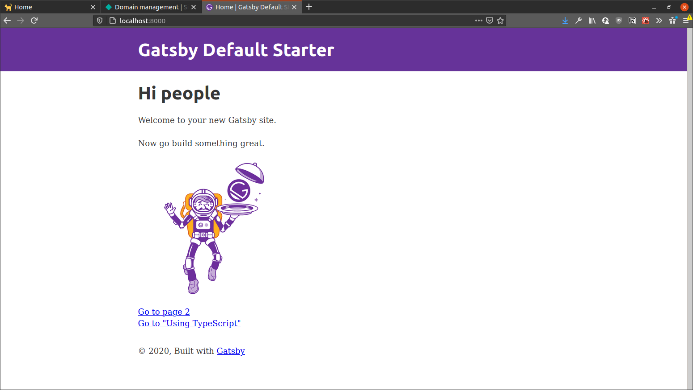

I've done it again. Created the blog again. From scratch. Again? Kind of.

I didn't like my first site. It was made from a template. I'm better than that. No disrespect to the author, but I like to write my own code and that's okay.

In early 2020 I tried to rebuild it, but didn't like it. I was also in a bit of a slump, because I didn't like my job. I don't like it now, but I'm getting back in to coding because that's what I want to do. That's a different story. A different post.

The old site, currently hosted at [hjf.io](https://hjf.io), was from a template: [Lumen](https://www.gatsbyjs.com/starters/alxshelepenok/gatsby-starter-lumen). I liked the template, plenty of white with some black and an accent colour. Sound familiar?

I've also been toying with Tailwind and MDX. I've also tried Next - didn't like it. I wanted to play with all the tech that I liked and do away with those that I didn't. 

The stack for this website is:
* Gatsby
* TailwindCSS
* MDX (and frontmatter ❤️)
* Netlify for hosting
* Netlify functions

I don't have a pretty architecture diagram for you. Else, I'd have spent my time making a powerpoint and not doing anything productive.


## ⚛️ Gatsby Config

To start I picked up the default Gatsby starter. This is the aptly named `gatsby-starter-default`.

```bash
yarn global add gatsby-cli
gatsby new . https://github.com/gatsbyjs/gatsby-starter-default
gatsby develop
```



Now that there is a default Gatsby skeleton running, we're got to add plugins. A lot of plugins. 

This is the way.

I'm in two minds about plugins. On the one hand, I love them: You pull in everything that you need do to your task and it just (mostly) works. It's a bit of lego-programming. 

On the other hand, I think it pushes a mindset of 'get a library to do it, don't program it'. 

I don't like the extreme part of this, where everything's just libraries linked. You don't get a lot of control, or understanding of your code. I don't htink you grow much as a developer, either.

I think this is why, in part, I didn't want to rewrite the original site. I don't have as much control over the code running in the background. 

There's an argument to be made for using libraries and abstraction though. Let's not reinvent the wheel. Unless we can get 4 of them and slap a turbo on it.

Anyway, the Gatsby way is great. Use Markdown to format text, use GraphQL to fetch data and use plugins to enhance your site. It's nice to get a 'way' to do something in React.

I've kept with the some base plugins this time. I wanted to keep it simple enough to maintain, but give a slick user experience for when I show the site to my mum. 

Plugins in use are:
* mdx
* react-helmet
* sass
* sharp
* prismjs
* smartypants
* filesystem

**Note:** at this point, if you intend on using MDX, you need to make a few config changes. It took me a while to figure this out. Don't be like me, steal code from me.

Add the correct MDX dependencies:

```bash
yarn add gatsby-plugin-mdx gatsby-plugin-filesystem @mdx-js/mdx @mdx-js/react
```

Configure `gatsby-plugin-filesystem` and point it to your mdx files!

Once I'd configured my plugins, I set out to create one template (for now), as well as a page for [home](/), [blog posts](/blog) and [quick hacks](/hacks) (these are [cool](/hacks)). My [about](/about) and [/uses](/uses) both use mdx.

## 💀 MDX Skel

Finally, I wanted to make pages easy to modify. Ease of editing with Markdown. Custom configuration with Frontmatter. Added functionality with React. MDX provides all of these (Frontmatter is afforded via `gatsby-plugin-mdx`).

For the uninitiated, Frontmatter adds some bonus YAML (ew) to the header of any Markdown/MDX page. This is metadata that we can query. My pages use:
* Title: what to show on the page
* Date: Some pretty metadata 
* Type: Blog/Hack/Other - This lets me filter for my hacks/blog pages. Remember that /uses and about aren't a blog or a hack
* Path: Where the page should live
* Description: Something to entice the reader
* Feature Image: Ooh shiney!


## 🐦 TailwindCSS 

At the time of writing, Tailwind has just hit 2.0. This is great, but `gatsby-plugin-sass` uses PostCSS 7, which isn't compatible. I had to pull in [a compabitility build](https://tailwindcss.com/docs/installation#post-css-7-compatibility-build)

```bash
npm uninstall tailwindcss postcss autoprefixer
npm install tailwindcss@npm:@tailwindcss/postcss7-compat @tailwindcss/postcss7-compat postcss@^7 autoprefixer@^9
```

## 🏡 Homepage
I'm pretty proud of the [homepage](/). As well as the 4 most recent blog posts, it shows my most recent (public) commits on [Github](https://github.com/hjfitz) and my most recent [Tweets](https://twitter.com/__hjf). Each of these modules work differently.

There's some basic logic to the blog posts: do it the gatsby way, fetch the posts via graphql. I'll chat more about frontmatter later.

```graphql
  query PageContentQuery {
      allMdx(limit: 4, filter: {frontmatter: {type: {eq: "blog"}}}, sort: {fields: frontmatter___date, order: DESC}) {
          edges {
              node {
                  id
                  timeToRead
                  frontmatter {
                      path
                      title
                      date
                      description
                      featureImg {
                          childImageSharp {
                              fluid(maxWidth: 400) {
                                  ...GatsbyImageSharpFluid
                              }
                          }
                      }
                  }
              }
          }
      }
  }
```

From the beginning, Twithub and Gitter work the same: When the homepage is built, use the `onCreatePage` hook in `gatsby-node.js` to fetch the data fro the respective websites and add them to the page context. I'll talk more about this in another post though.

This is fine - but I'm likely to write code after this is published. On page load, the modules simply use a custom hook to refresh the data. 

The Github functionality calls the same function that gets called in the page building process. Twitter is slightly different though... Their API is a little contrived and I need a key to call read my own tweets. I've abstracted this in to a Netlify function, which I'll detail in another post... Their documentation is somewhat lackluster.

The other pages, Blog and Hacks just pull in all mdx pages where their type === the page type. There's not much interesting there.

## 🎁 Wrap-up

And that's it! I just started coding from there, threw a few deployment errors, struggled with DNS. We got this thing hosted.

I'm already really enjoying working on this site. It's looking better than I thought it would. I can add lots of functionalty via MDX, too. We're in the early days and I'm excited to see how the thing evolved.

There were a few posts that I gave reference to - 

* Working with [Netlify functions](/netlify-functions/)
* Injecting data in to a Gatsby page without GraphQL (To write)

