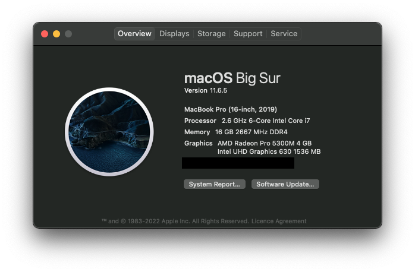
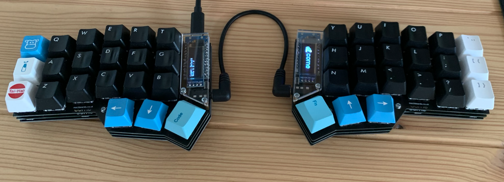
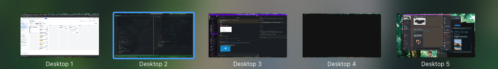
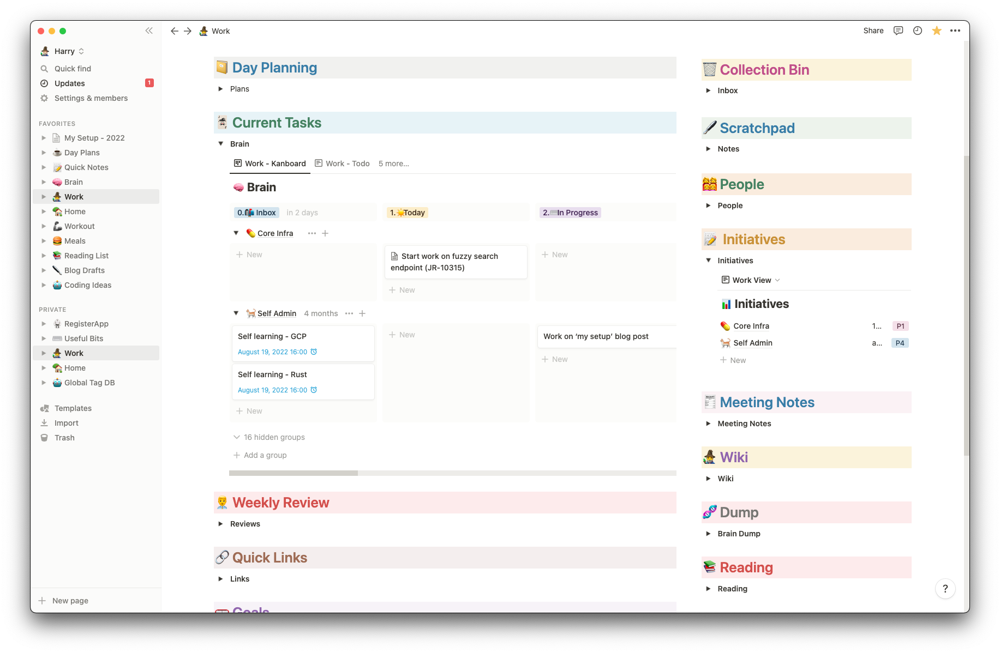
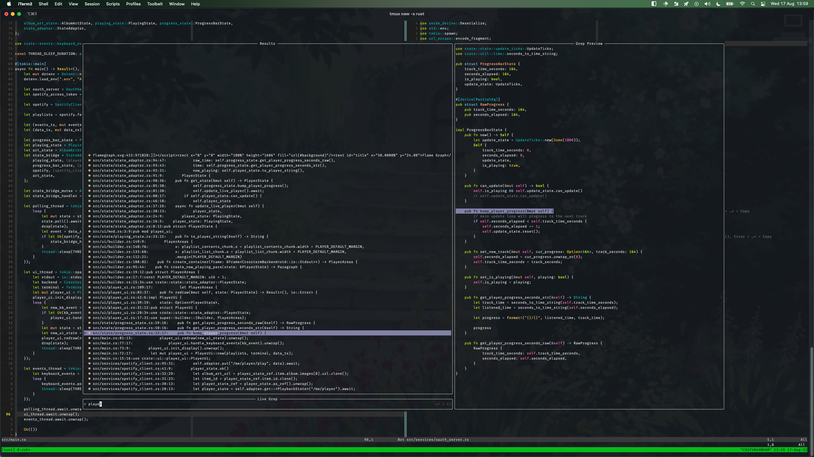

For the longest time I’ve been interested in how other software engineers, and people in general, get stuff done. Moreover, the tools that they use to get everything done. 

More recently, I’ve been reflecting internally about how I get my stuff done. 

This is going to be an unapologetically long post about how I do me. If you’ve not got the attention span, I’ve got a `/uses` page that’s a little terse (shout out to uses.tech).

A little about me first - I’ve been working with computers professionally and unprofessionally for about 10 years now. I got in to it by tinkering with linux servers and hosting my own stuff. I always thought I’d end up as a sysadmin, but I’ve somehow ended up as a software engineer. I’ve worked at larger corporations and startups through a variety of roles. I’ve lead, designed and broken my way to this place.

For this post I’m going to go from the highest level, hardware, to the lowest level, software and plugins.

## **Hardware**

My daily driver is a laptop, a Macbook Pro. I’ve been using this thing professionally for about 5 years now and. Whichever iteration I’ve had has always been incredibly capable and enough to cater to my requirements.

I’d always prefer to use some kine of *nix, and if given the opportunity at work, I’d jump straight back on to a Debian box. MacOS is fine. Hell, FreeBSD would be fine. I’m glad I’m not on Windows. I don’t care what you say about WSL, the vibe is off.

With a modern Macbook comes dongles, and with those dongles comes peripherals:

### **Display **

- **Crua 27in QHD Monitor: **It’s an Amazon special, and that’s the only special thing about it. it’s superbly affordable, without being offensively bad.

- **Logitech C505e Webcam: **When working remotely, I think it’s key to have a good picture and decent audio quality. This webcam is an example of something that’s “better than good enough without breaking the bank”.

### **Audio**

Everything is better with music, and it plays a key part in my engineering. I like to have some music in the background to help enhance my focus.

- **Logitech Z150 Speakers: **These are the general use noise-makers and are perfect for my needs. The audio is clear without the need for any additional accessories.

- **Beyerdynamic DT-990 Pro Headphones:**  If I really need to feel wired in, I’ll opt for these. I’ve had these for a significant amount of time. More than 10 years and the only thing I’ve replaced is the cable, because the coils were winding in a strange way.

- **Apple AirPods Pro:** These are perfect for calls - meets, teams, zoom etc. The quality of both speaker and mic is excellent, and they’re low profile enough to make it look as though you’re having a normal conversation

### **Peripherals**

We need things to interface with the computer. I’ve got a standard mouse and keyboard setup - but the keyboard is far from standard.

- **Steelseries Sensei Wireless Mouse:** I’ve been using the sensei since it first came out. It’s a great mouse, but they need replacing from time-to-time. The scroll wheel is getting confused, so it’s time for a replacement or an entirely new mouse. I’m eyeing up the Logitech MX Master for my next mouse due to it’s ability to connect to multiple computers and it’s ergnomics.

- **Corne Keyboard (crkbd):** This is the first split keyboard I’ve used, and the first mechanical keyboard I’ve built. It has Gateron Black switches for a linear feel that requires a little more pressure than normal

The Corne keyboard is an incredibly unique keyboard in a few ways. not only is it split in to two boards for ergonomics. but there’s no row for numbers, no arrows and few symbols. instead it makes use of layers. The shift key gives you the upper-case layer on a keyboard and this crkbd has a layer for numbers and another for symbols. The result of which is that you never need to move your hands around to hit any key.

I’ll write this keyboard some justice in it’s own post, but my 2-week review of this is that it’s far better than anything else I’ve used, and often find myself wanting to control applications with this.

## **Software**

I’ve been tuning this for a while to make me a quick developer, without losing any of my focus. MacOS is my operating system of choice right now - chosen for me by my various employers. It’s not an awful experience, but I do yearn for the days of a tiling window manager (like DWM) on a minimal Debian/Arch install.

My focus splits between 4 main workspaces. Everything stays on it’s own workspace, that way I know what I’m meant to be doing without any context-switching.

I don’t full-screen my windows, I expand them to the size of the workspace. This makes it easy to jump between them, and stops maximising something else interfering with them.

My 4 workspaces can be condensed in to

1. Web Browsing

1. Engineering

1. Communication

1. Music

The music workspace acts as a bit of a barrier between work and other apps that I use in an unstructured way.

I’ll write about the tools and things that I use to work on a per-workspace basis.

### **Chat and Music**

There’s not terribly much to discuss here, so I’ll start with these workspaces.

Spotify is, well, Spotify. I’ve been building on the same playlist for a few years now, and that’s what helps me hit a flow state. This playlist is called “full snack web development” and if you’re keen on electronic noises, head on over. 

If I’m really struggling with my focus, I’ll listen to a video game soundtrack. Civ VI and Halo have been my go-to recently.

---

As for chat, I use Slack for work, but I generally prefer Teams wherever possible. There’s not much more to it. I think that huddles are a great feature of Slack and pretty powerful for pairing with other engineers.

Tuple works much better. Unfortunately there’s not a free tier yet, because it’s probably the best app out there for pair programming. The steam is silky smooth, there’s no need to ask to use your partner’s keyboard and mouse (like IRL pairing).

### The Web and Webapps

I use Google Chrome as my daily web browser. Sync, Profiles and all round being a mature piece of software makes it the best option for me. I used to use Firefox, and I’ve given Brave a go, but they just don’t compare.

At the time of writing, I’m a full-stack software engineer and thus, some of my engineering capacity leaks in to this workspace. To help this, I use the React and Redux devtools addons. 

As most people that use the web, I use an adblocker (ublock origin is my go-to). 

I also use an application called Scribe which, when started, records what I do on the web. When I stop recording, it auto-generates a step-by-step set of instructions to replicate what I did. This is incredibly useful for reporting bugs, or showing a junior how to generate a PAT on Github.

A lot of my work happens either on localhost, or Jira. Both are just as buggy, but I think Jira (and Confluence) are excellent tools - as long as they don’t delete everything again.

Finally, I use Notion. It’s an incredibly flexible note-taking (??) tool that I’ve molded to fit my brain. My overall workflow follows GTD and Notion facilitates that. 

#### Notion

My notion setup consists of a number of key databases. I try to drive as much as possible here, though I use ticktick as a collection bucket and habit tracker.

1. **Global Wiki** - any document or page with some information that I want to keep goes in here. Everything here is generally tagged on a per-project basis

1. **Projects/Initiatives** - any large task like *Self Admin*, *my current project* or any other *side project* at work will live in here. Each project has a restricted view on the Global Wiki or Task databases: only show tasks or pages that are tagged with the appropriate project.

1. **Tasks** - any ‘thing’ that needs to be done goes here. It has a simple filter to keep everything that’s relevant in my view. This is generally seen as a kanboard, with 8 columns. 

1. **Day Plans -** Finally, my day plans. This is, not where I plan my day, but where my day is planned for me. I go through a checklist for each part of the day. Early morning, logging on, lunch and after work. These tasks help me organise my day and build habits as I go.

### **Email and Calendar**

My current employer uses GSuite to manage everything. I generally don’t mind, and use Protonmail for my own mailbox and calendar. I will say that Gmail and the calendar that comes with if often feel like they’re toy applications, rather than something production ready. I’m used to Outlook and the O365 suite, so that might be part - but it never feels *proper* to use gsuite.

Although I get significantly less email now, compared to what I had when I was leading teams, I still try to keep my inbox organised. This doesn’t mean hitting the elusive “Inbox 0”, this means knowing where everything is and what needs to be done with it. Stealing directly from GTD, I organise my emails in to folders:

1. **Action:** Things that need to be actioned, or turned in to a task in my Notion brain the following morning

1. **File: **Things that are useful for later. Things like conversations that need to be referred to, or noddy stuff like jury duty forms. It’s important that this doesn’t become a dumping ground for the hoarder’s “just in case” pile. If it’s irrelevant, bin it.

1. **Process: **Emails that need some time spent thinking, or will need a response. Those emails are normally ones that could be split in to multiple tasks in the board.

### **Engineering**

My engineering workspace generally just consists of iTerm - everything else lives in there. Outside of iTerm, I use tools like MongoDB Compass, PGAdmin and Postman when the CLI fails me.

#### **Editor**

I don’t use VS code. I think it’s a good-enough text editor, but I’ve been using neovim for a while now. It pairs exceptionally well with the Crkbd which gives a fantastic developer experience. I feel like I’ve got more control that I never used to have.

I’ve recently rewritten my config as part of a move from vimscript to lua. You can look at all of my config in my dotfiles on Github. I’ll talk about the most useful ones below:

- `lspconfig` - LSP is notorously a pain to setup for vim, and I’m sure that 90% of the developers out there using neovim with LSP use this for everything. I’ve configured LSP for TypeScript and Rust development.

- `telescope` - an incredibly useful tool for navigating around the project - I’ve mapped `ff` to finding a file, and `fg` to find some function call

- `neogit` - whilst still under some pretty heavy development, it’s a pleasure to work with. This shows a nice diff of files changed, which files are new and so on. It makes self-reviewing code before pushing a nice experience.

As for my colorscheme, I use PaperColor with a transparent background. I find this to be pretty unoffensive, whilst highlighting everything well enough.

I’ll always run neovim in tmux, so that I can switch between projects easily - and quickly go back to where I was. splits are also very useful in tmux.

Below is a pretty typical overview with telescope open.

Whilst we’re in the terminal, I’ll add that I’ve been working on a spotify client to reduce the need for another workspace. It just needs some logging and I’ll be pretty happy with it. It controls your now-playing and shows it. The album art consists of individually coloured block characters.

---

## Conclusion

I’m overall fairly happy with my development setup. I think that some of the niceties that MacOS provides could slow me down. I’d much prefer to use a tiling window manager on some Linux distro at some point. I’m happy with the move to the split keyboard, though it’s making it difficult to use a normal keyboard. An upgraded mouse would complete the setup for me.

I’ll aim to create a new post at around the middle of next year with any updates (and likely less detail).
